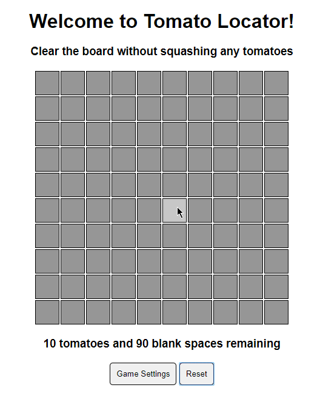

# Tomato Locator

## Background

[Tomato locator](https://billwiegert.github.io/tomato-locator/) is a tomato themed clone of Minesweeper. It was implemented using HTML, CSS, and JavaScript (ES6). Webpack was used to bundle and minify JavaScript source code.

## How to Play

The goal of the game is to reveal all empty tiles without revealing any tomatoes. Click on a gray tile to reveal it. Empty tiles will display a number indicating how many tomatoes exist within the 8 adjacent tiles, or zero otherwise. When a tile with no neighboring tomatoes is revealed, all neighboring tiles will also be revealed recursively. If you think you have located a tomato you can right click to mark the tile with a flag. Double clicking on a revealed, empty cell will reveal all unflagged neighboring cells.

